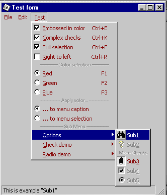



## CoolMenu v1\.3

### Description

Real Office and Visual Studio like icon menus 

New features : 

-White bug fixed 

-Pattern behind simple checks 

-Main menu bar repop bug fixed in W98 

-RightToLeft property (still to be tested) 
 
### More Info
 

             |
---                |---
**Submitted On**   |2000-08-15 20:17:08
**By**             |[Olivier Martin](https://github.com/Planet-Source-Code/PSCIndex/blob/master/ByAuthor/olivier-martin.md)
**Level**          |Advanced
**User Rating**    |4.9 (204 globes from 42 users)
**Compatibility**  |VB 5\.0, VB 6\.0
**Category**       |[Custom Controls/ Forms/  Menus](https://github.com/Planet-Source-Code/PSCIndex/blob/master/ByCategory/custom-controls-forms-menus__1-4.md)
**World**          |[Visual Basic](https://github.com/Planet-Source-Code/PSCIndex/blob/master/ByWorld/visual-basic.md)
**Archive File**   |[CODE\_UPLOAD89888152000\.zip](https://github.com/Planet-Source-Code/olivier-martin-coolmenu-v1-3__1-10692/archive/master.zip)

